Time Series Analysis and Prediction of Facebook Historical Stock Prices
================
Frank Jiang
12/11/2020

## Description

### Business Interest and background

Stock market has always its unique place both in the financial world and
data science. How can we obtain useful information from recent stock
data to predict the ups and downs at the next moment? Traditional
machine learning models seem to be capable of identifying the dependency
in the stock market prices sequence. However, the high conditional
volatility and non-stationary challenges ML models especially to add the
time dimension as input features.

Therefore, the main interest remains the best model and algorithm for
predicting trends for stock prices as well as the corresponding risk.
Autoregressive Intergrated Moving Average(ARIMA) Model are extensively
used in the field of finance and ecnomics as it is known to be robust,
efficient for short-term share market prediction. Furthermore, in order
to measure the risk variance in the prediction, we also incorporated the
ARMA-GARCH model.

## Data

### Dataset

The data we used in this project are the daily historical Facebook stock
prices(open, high, low, close, adjusted prices, and volume) from May
18th, 2012 to November 4th, 2020.

### Data Source

This data can be accessed and scrapped from the Yahoo Finance Website.

Source: <https://finance.yahoo.com/quote/FB/history?p=FB>

### Data Preprocessing

``` r
FB_Stock_Price<- read.csv('FB_Stock_Price.csv', header=TRUE)
FB_Stock_Price<- FB_Stock_Price %>% mutate(Date = as.Date(Date))
```

## Result and Analysis

### Exploratory Analysis

First of all, we plot the time series of Facebook’s close price from
2012 to 2020. We can observe that the mean is not zero and the variance
is very high. This indicates that the time series is non-staionary.
Therefore, we decide to take the log of the Facebook’s stock close
price.

``` r
# plot the close price of Facebook stock
FB_Stock_Price_Inital<- xts(x=FB_Stock_Price$Close, order.by=FB_Stock_Price$Date)
names(FB_Stock_Price_Inital)<- 'Close'
Plot_Initial<- dygraph(FB_Stock_Price_Inital, main='Time Series Plot of the Facebook Stock') %>% 
  dySeries('Close', label='Close Price') %>% 
  dyOptions(colors='#e41a1c')%>% 
  dyRangeSelector()

Plot_Initial
```

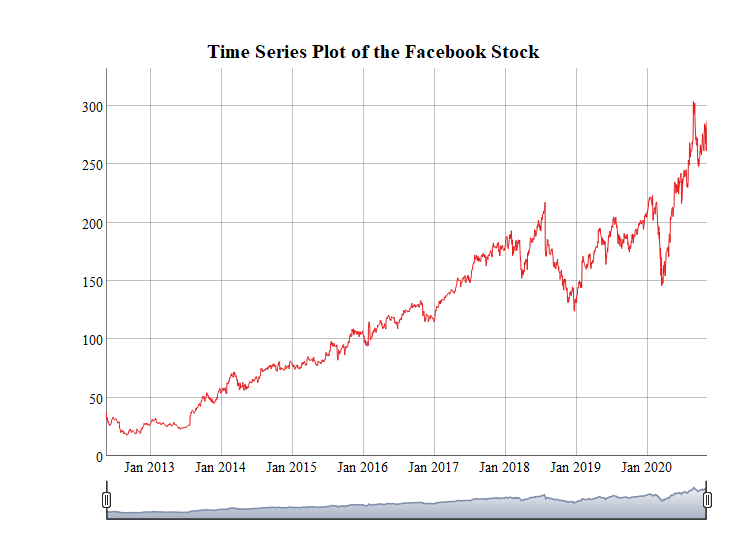<!-- -->

### Time Series

``` r
#Take the log value of stock price
FB_Stock_Price<- FB_Stock_Price %>% mutate(Date = as.Date(Date), Log_Price=log(Close))
FB_Stock_Price_log<- xts(x=FB_Stock_Price$Log_Price, order.by=FB_Stock_Price$Date)
names(FB_Stock_Price_log)<- 'Log_Price'
Plot_log<- dygraph(FB_Stock_Price_log, main='Time Series Plot of the Facebook Stock Log Price') %>% 
  dySeries('Log_Price', label='Log Price') %>% 
  dyOptions(colors='#e41a1c') %>% 
  dyRangeSelector()

Plot_log
```

<!-- -->

``` r
#ACF and PACF of the log price
acf(FB_Stock_Price$Log_Price)
```

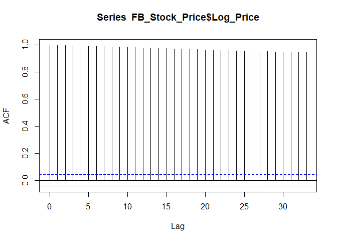<!-- -->

``` r
pacf(FB_Stock_Price$Log_Price)
```

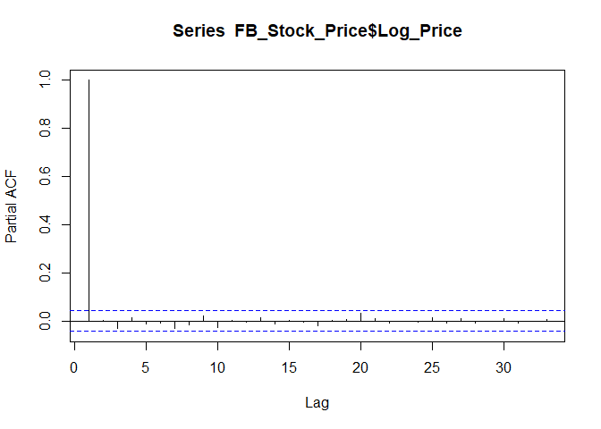<!-- -->

We plot the time series, ACF, and PACF of the time series. We can
observe that the ACF correlation slowly decays to zero. Therefore, we
decide to take the difference of the log price, which is the return of
the log price.

From the time series plot of the log return of the stock price, we can
observe that the mean is 0. The ACF and PACF plot later prove the point
that the log return of the stock price are stationary.

``` r
#Take the first difference
FB_Stock_Price<- FB_Stock_Price %>% mutate(Date = as.Date(Date), Log_Price=log(Close), D1_Log_Price=c(0,diff(Log_Price,1)))
#save last observations
last_obs<- FB_Stock_Price$Log_Price[[2131]]

FB_Stock_Price_diff<- xts(x=FB_Stock_Price$D1_Log_Price, order.by=FB_Stock_Price$Date)
names(FB_Stock_Price_diff)<- 'Diff Log'
Plot_diff<- dygraph(FB_Stock_Price_diff, main='Time Series Plot of the Facebook Stock Price') %>% 
  dySeries('Diff Log', label='Diff Log Price') %>% 
  dyOptions(colors='#e41a1c') %>% 
  dyRangeSelector()

Plot_diff
```

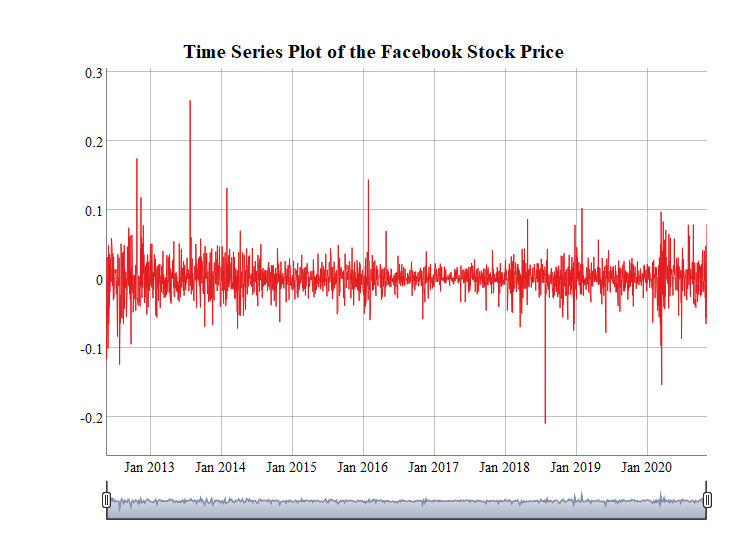<!-- -->

### ARIMA

``` r
acf(FB_Stock_Price$D1_Log_Price)
```

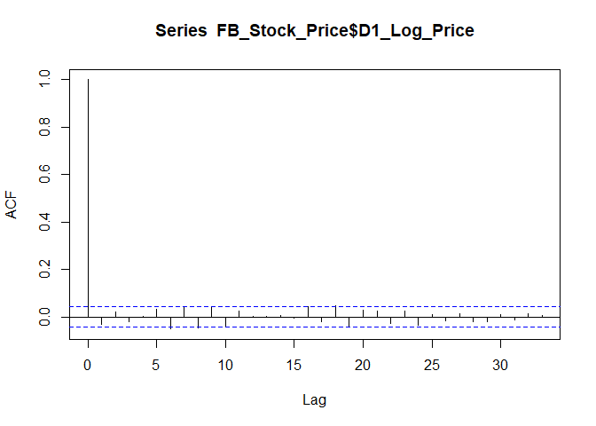<!-- -->

``` r
pacf(FB_Stock_Price$D1_Log_Price)
```

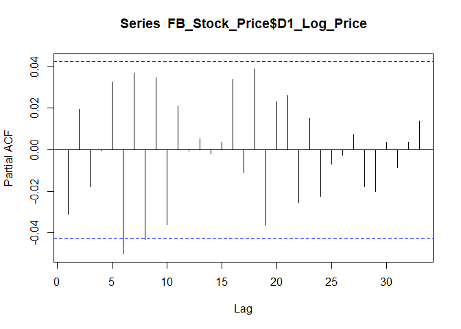<!-- -->

From the ACF plot, we can see that the correlation cuts off at 0 and
from the PACF plot, we observe that the correlation cuts off at 6.
However, it is really for the benefit of model fitting to choose
ARIMA(p,1,q) with p and q less than 2. (\*Note, this means that ARIMA
might not be a suitable model for this data.)

### ARIMA Model Fitting & evaluation

Here we fit the ARIMA model using p from 0 to 2 and q from 0 to 2.

``` r
#Select ARIMA model using AICC
arima_model<- auto.arima(FB_Stock_Price$Log_Price,d=1, max.p=2, max.q=2, ic='aicc',allowdrift = T)
summary(arima_model)
```

    ## Series: FB_Stock_Price$Log_Price 
    ## ARIMA(2,1,1) with drift 
    ## 
    ## Coefficients:
    ##           ar1     ar2     ma1  drift
    ##       -0.2145  0.0160  0.1838  9e-04
    ## s.e.   0.4883  0.0258  0.4881  5e-04
    ## 
    ## sigma^2 estimated as 0.0005523:  log likelihood=4968.78
    ## AIC=-9927.55   AICc=-9927.53   BIC=-9899.24
    ## 
    ## Training set error measures:
    ##                        ME       RMSE        MAE          MPE      MAPE
    ## Training set 4.484534e-06 0.02347246 0.01539577 -0.002084103 0.3577818
    ##                   MASE          ACF1
    ## Training set 0.9971194 -0.0001547729

``` r
# save residuals
arima_res<- arima_model$residuals

#plot residuals
plot(arima_res)
```

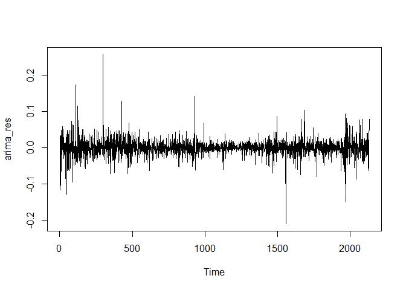<!-- -->

``` r
#ACF and PACF of residuals
acf(arima_res)
```

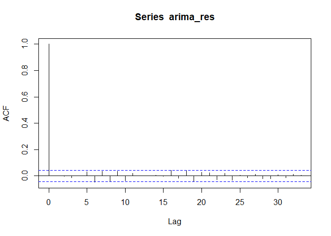<!-- -->

``` r
pacf(arima_res)
```

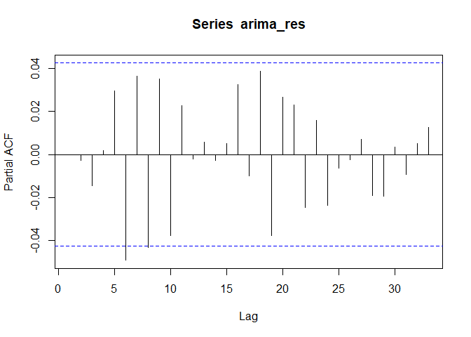<!-- -->

``` r
#Box test
Box.test(arima_res, type='Ljung-Box')
```

    ## 
    ##  Box-Ljung test
    ## 
    ## data:  arima_res
    ## X-squared = 5.1119e-05, df = 1, p-value = 0.9943

``` r
# save fitted values
arima_fit<- arima_model$fitted

# one-step ahead forecast and 95% Confidence Interval
forecast(arima_fit, h=1, level=95)
```

    ##      Point Forecast    Lo 95    Hi 95
    ## 2132       5.581503 5.537127 5.625878

Based on the AICc value, we can conclude that the best ARIMA model is
ARIMA(2,1,1). The full model is: \[x_t=y_t-y_{t-1}\]
\[x_t=-0.2145*x_{t-1}+0.0160*x_{t-2}+0.1838*\epsilon_{t-1}+\epsilon_t\],where
\[y_t\] is the log of Facebook Stock Close price and \[x_t\] is the
differenced log Facebook Stock Close Price. The one step ahead forecast
of log Facebook Stock Price is 5.5815 with the 95% forecast interval of
\[5.5371, 5.6259\]. (We will later discuss that this is not accurate)

We can also conclude that the residuals are not correlated based on the
ACF and PACF plot. However, the squared residuals have significant
autocorrelations. This implies that the residuals are uncorrelated but
not independent of each other. The Box-Ljung test proves our
conclusion(p-value of 0.9).

### ARMA-GARCH

Since the ARIMA model does not give us a good result. The ARIMA results
are biased since it is explained by votaile observations of dataset and
financial market series. Therefore, GARCH model is being used as it has
the foundation on making ‘Volatility Clustering’. It is typical that
stock market contains period with relative calm movements and high
volatility in other times. Therefore, GARCH model can be used to
minimize the volatility effect.

``` r
# effective sample size
N<- length(FB_Stock_Price$Log_Price)-1

# function to calculate AICc
AICC_generator<- function(N, q, loglik){
  -2*loglik+2*(q+1)/(N/(N-q-2))
}

#Fit ARCH models
arch<- tibble(q=c(0:10), loglik=0)

#calculate the loglikelihood AR(0)
arch[1,2]<- -0.5*N*(1+log(2*pi*mean(arima_res^2)))
#AR(1-10)
for (i in 1:10){
  arch_mod<- garch(arima_res, c(0,i), trace=F)
  arch[i+1,2]<- as.numeric(logLik(arch_mod))
}

#calculate AICC
arch<- arch %>% mutate(AICc= AICC_generator(N,q,loglik))
```

``` r
#calculate AICc
ifelse(min(arch)<AICC_generator(N,2,logLik(garch_model)),'select ARCH model','Select GARCH(1,1) Model')
```

    ## [1] "select ARCH model"

``` r
#garch model
summary(garch_model)
```

    ## 
    ## Call:
    ## garch(x = arima_res, order = c(1, 1))
    ## 
    ## Model:
    ## GARCH(1,1)
    ## 
    ## Residuals:
    ##        Min         1Q     Median         3Q        Max 
    ## -1.116e+01 -4.550e-01  5.878e-04  5.042e-01  1.391e+01 
    ## 
    ## Coefficient(s):
    ##     Estimate  Std. Error  t value Pr(>|t|)    
    ## a0 9.536e-05   7.497e-06   12.719   <2e-16 ***
    ## a1 1.999e-01   2.063e-02    9.688   <2e-16 ***
    ## b1 6.556e-01   2.672e-02   24.533   <2e-16 ***
    ## ---
    ## Signif. codes:  0 '***' 0.001 '**' 0.01 '*' 0.05 '.' 0.1 ' ' 1
    ## 
    ## Diagnostic Tests:
    ##  Jarque Bera Test
    ## 
    ## data:  Residuals
    ## X-squared = 69438, df = 2, p-value < 2.2e-16
    ## 
    ## 
    ##  Box-Ljung test
    ## 
    ## data:  Squared.Residuals
    ## X-squared = 0.10772, df = 1, p-value = 0.7428

``` r
logLik(garch_model)
```

    ## 'log Lik.' 5080.745 (df=3)

We Calcuate the AICc value, and used it as the criterion for model
selection. Finally, an GARCH(1,1) is selected. The full model should be
the following: \[\epsilon_t|\psi_{t-1} \in N(0,h_t)\]
\[h_t=1.106\times10^-6+0.01792\times\epsilon^2_{t-1}+0.98\times h_{t-1}\]
The unconditional variance is significant, however, extremly close to
zero.

### Forecasting

We then use the GARCH(1,1) model to construct the 95% confidence
interval one-step forecast for the log of Facebook’s Stock Price.

``` r
#conditional variance
ht<- garch_model$fit[,1]^2
#construct 95% one step ahead forecast interval 
#for the log price of facebook stock
for_var<- coef(garch_model)[1]+coef(garch_model)[2]*tail(arima_res,1)^2+coef(garch_model)[3]*tail(ht,1)

#lower bound
as.numeric(forecast(arima_model, h=1)$mean)-1.96*sqrt(as.numeric(for_var))
```

    ## [1] 5.57249

``` r
#upper bound
as.numeric(forecast(arima_model, h=1)$mean)+1.96*sqrt(as.numeric(for_var))
```

    ## [1] 5.746718

Based on the ARMA-GARCH model, the forecast interval is
\[5.6026,5.7166\], which is different than the ARIMA(2,1,2) model.
However, the intuition is that the ARMA-GARCH should be more accurate
results than the ARIMA model.

### Evaluation & Validation

Here, we graph the one-step forecast graph using the ARMA-GARCH model
together with the log price of the Facebook stock. We can see that the
prediction are relatively accurate.

``` r
FB_Stock_Price %>% mutate(ht=ht) %>% 
  ggplot(aes(Date,ht,na.rm=T))+ 
  geom_line(col='red')+
  scale_x_date(date_breaks='12 months')+
  theme(axis.text.x=element_text(angle=45,vjust=.6))
```

    ## Don't know how to automatically pick scale for object of type ts. Defaulting to continuous.

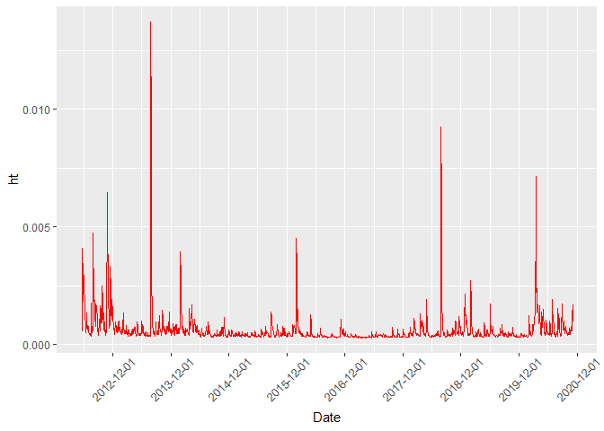<!-- -->

``` r
low<- arima_fit-1.96*sqrt(ht)
high<- arima_fit+1.96*sqrt(ht)
plot(FB_Stock_Price$Log_Price[-1],type='l',xlab='Date',ylab='log Close Price',col='red')
lines(low[-1], col='#8dd3c7')
lines(high[-1],col='#8dd3c7')
legend('bottomright', legend=c('log closing stock price','1-step forcast'),col=c('red','#8dd3c7'),lty= rep(1,2))
```

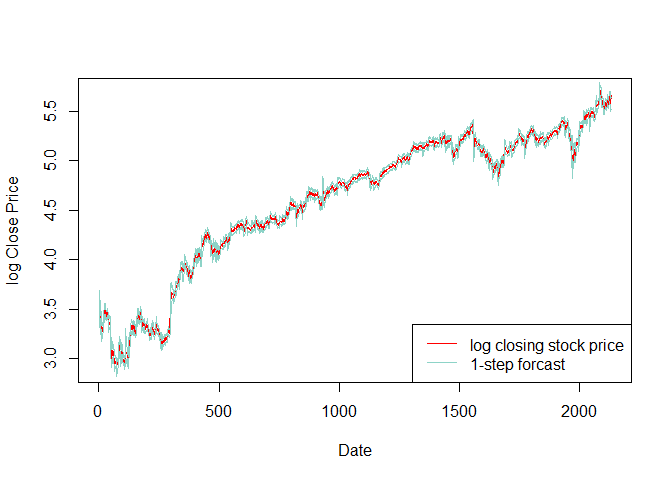<!-- -->

``` r
archres<- arima_res/sqrt(ht)
qqnorm(archres, pch=1, frame=F)
qqline(archres, col='blue', lwd=2)
```

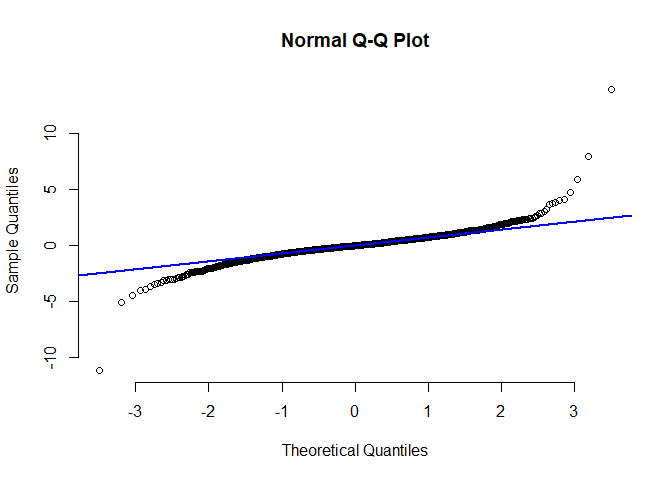<!-- -->

``` r
failure<- sum(abs(archres)>1.96,na.rm=T)
failure
```

    ## [1] 101

``` r
fail_pct<- failure/(length(archres)-1)
fail_pct
```

    ## [1] 0.04741784

However, the ARMA-GARCH model still does not seem to adequately address
the ‘long-tailedness’ in the data. When it is closing to the tail, we
can see that the data point does not fall on the line.

We also calculated that there are 88 failures in the prediction
comparing to the orginal data. The percentage of the time that the
interval fails is 4.1%, which is relatively good in prediction.

The 95% interval of one-step forecast for ARMA-GARCH model is
\[5.6026,5.7166\], for ARIMA(2,1,2) is \[5.5371, 5.6259\]. The real
observation is 5.6608 which lies in the interval of ARMA-GARCH model but
not in the ARIMA model. Therefore, ARMA-GARCH is the best model for
prediction.

### Deep Learning: Feed Foward Neural Network

``` r
#Hidden Layers Creation
alpha<- 1.5^(-10)
hn<- (length(FB_Stock_Price$Log_Price)-1)/(alpha*(length((FB_Stock_Price$Log_Price)-1)+30))

#Fitting nnetar
lambda<- BoxCox.lambda(FB_Stock_Price$Log_Price)
dnn_pred<- nnetar(FB_Stock_Price$Log_Price, size=hn, lambda=lambda)

#Forecast
dnn_forecast<- forecast(dnn_pred, h=1, PI=TRUE)
plot(dnn_forecast)
```

<!-- -->

The forecast interval using the Feed Forward neural network is
\[5.64,5.68\], which is much stricter interval than ARMA-GARCH model.
Therefore, Feed Forward Neural network might be the best model in
predicting the trends of Stock Prices.

## Drawbacks and Limitations

Although we use the ARMA-GARCH model to correct the ARIMA predictions
and provide a accurate model for predictions while addressing for the
volatility. However, there are multiple other techniques and model we
could later use to predict the trends.

Prophet Forecasting is a forecasting model for supply chain management,
sales and economics, developed by Facebook’s core Data Science Team,
which includes the seasonality with Fourier series and addressing for
other major events(such as COVID).
