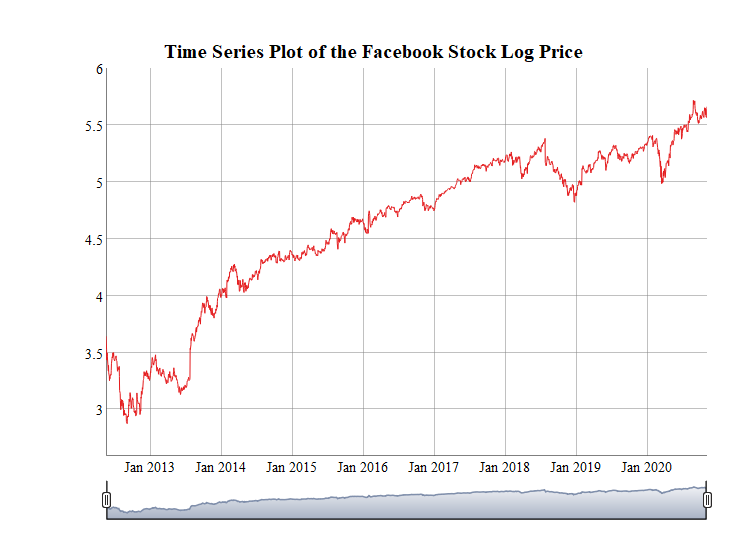
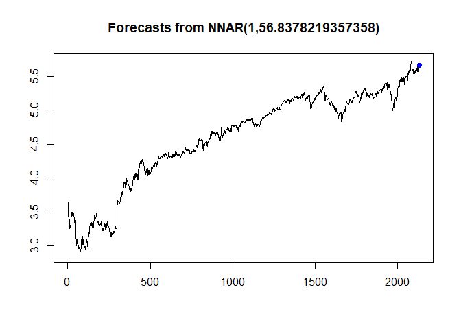

# Forecasting-Facebook-Stock-Price-Trends-and-Volatility
Created by Frank Jiang

---
### Table of Contents
   - [Description](#Description)
   - [Data](#Data)
   - [Model Fitting](#Model)
   - [Forecasting and Evaluation](#Evaluation)
   - [Limitations](#Limitations)
## Description
 
### Business Interest and background
Stock market has always its unique place both in the financial world and data science. How can we obtain useful information from recent stock data to predict the ups and downs at the next moment? Traditional machine learning models seem to be capable of identifying the dependency in the stock market prices sequence. However, the high conditional volatility and non-stationary challenges ML models especially to add the time dimension as input features.

Therefore, the main interest remains the best model and algorithm for predicting trends for stock prices as well as the corresponding risk. Autoregressive Intergrated Moving Average(ARIMA) Model are extensively used in the field of finance and ecnomics as it is known to be robust, efficient for short-term share market prediction. Furthermore, in order to measure the risk variance in the prediction, we also incorporated the ARMA-GARCH model, as well as deep learning model, Feed Forward Neural Network.

## Data
### Dataset 
The data we used in this project are the daily historical Facebook stock prices(open, high, low, close, adjusted prices, and volume) from May 18th, 2012 to November 4th, 2020.

This dataset can be accessed from Yahoo Finance Website:
Source: https://finance.yahoo.com/quote/FB/history?p=FB

### Data Preprocess
In order to apply the ARIMA model to a stationary data, we did some transformation to the original dataset, such as taking the log of the Stock price and take the first difference. 
For more information, you can access our final reports here: [Final_Report](Trends%20and%20Volaitility%20Analysis.md)

## Model
In this project, we fit the traditional ARIMA model as well as the ARMA-GARCH model to account for volatility and risk. We have also test the deep learning model:FNN
For detailed modeling and code, you can more than welcome to read our source code:
[SourceCode](Project.Rmd)

_*Figure 1 Feed Forward Neural Network Algorithm_

_*Figure 2 Time Series Plot of the log closing price of Facebook Stock_

## Forecasting & Evaluation
### Evaluation

The ARIMA model does not give us a good result. The ARIMA results are biased since it is explained by votaile observations of dataset and financial market series. Therefore, GARCH model is being used as it has the foundation on making ‘Volatility Clustering’. It is typical that stock market contains period with relative calm movements and high volatility in other times. Therefore, GARCH model can be used to minimize the volatility effect.

we graph the one-step forecast graph using the ARMA-GARCH model together with the log price of the Facebook stock. 

_*Figure 3 95% One-step forward Forecasting Interval_

We also calculated that there are 88 failures in the prediction comparing to the orginal data. The percentage of the time that the interval fails is 4.1%, which is relatively good in prediction.

_*Figure 4 Normality Plot_

We have also test the deep learning method: FNN, which seems to be a better forecasting model

_*Figure 5 Neural Network Forecast Time Series Plot_

## Limitations

lthough we use the ARMA-GARCH model to correct the ARIMA predictions and provide a accurate model for predictions while addressing for the volatility. However, there are multiple other techniques and model we could later use to predict the trends.

Prophet Forecasting is a forecasting model for supply chain management, sales and economics, developed by Facebook’s core Data Science Team, which includes the seasonality with Fourier series and addressing for other major events(such as COVID).

_*Figure 6 Prophet Forecasting Model used by Facebook_
